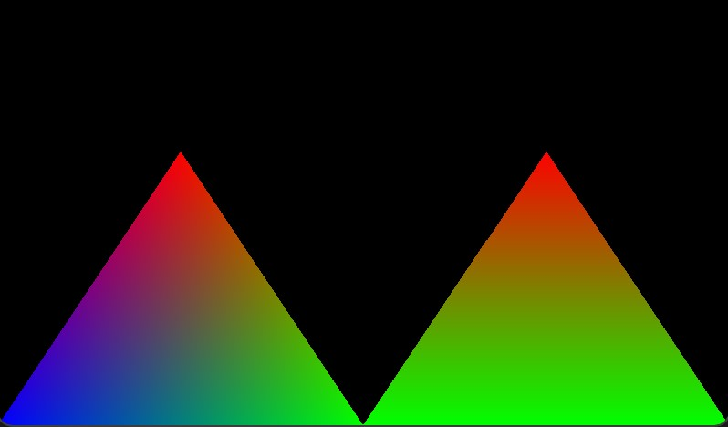
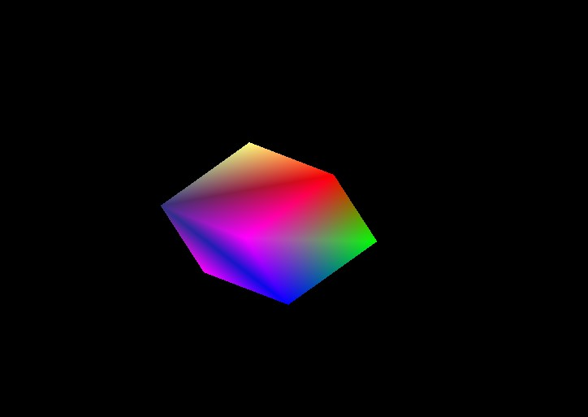
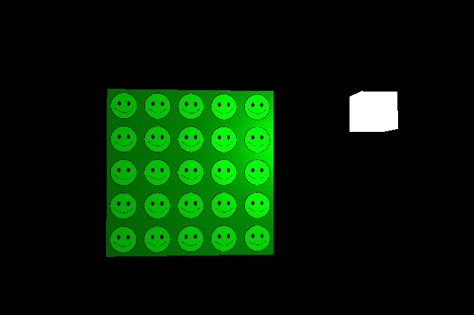
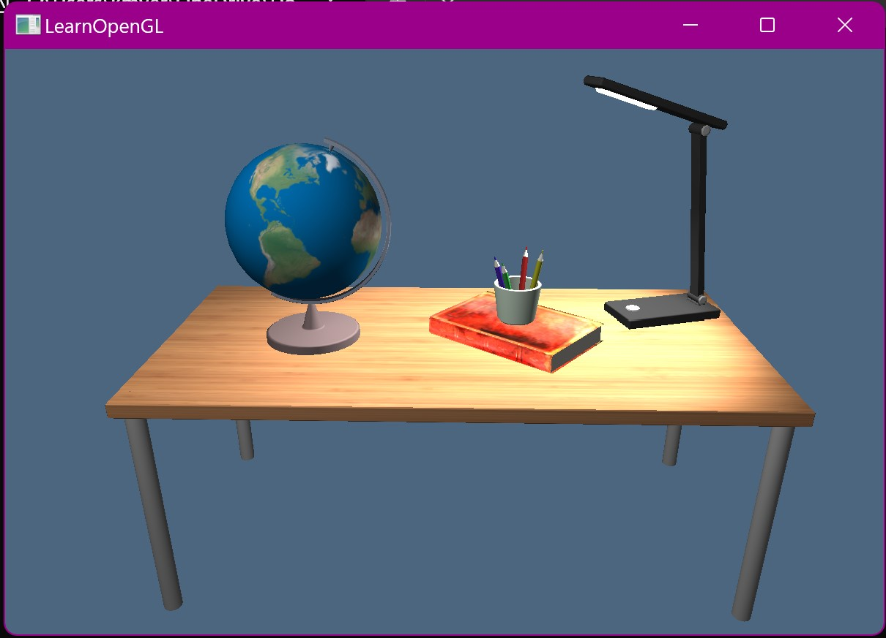
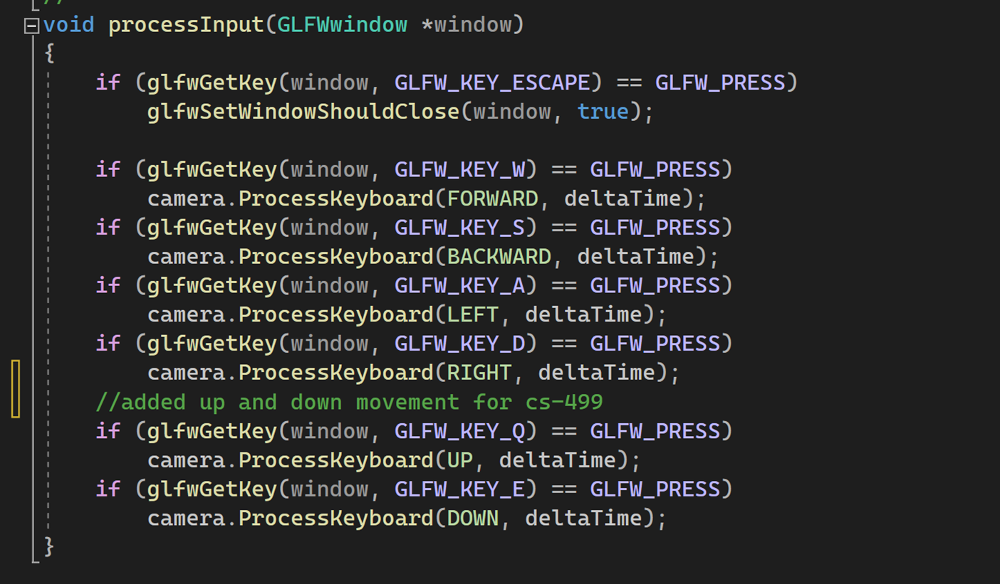
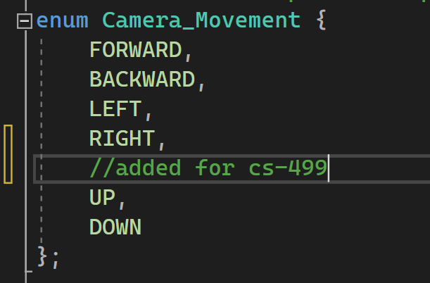
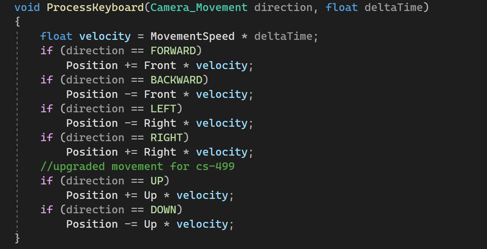
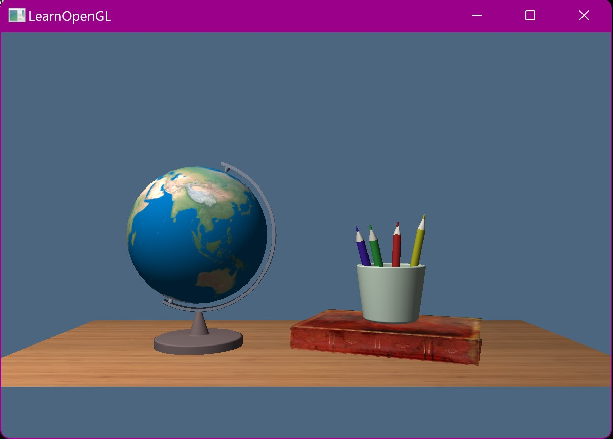
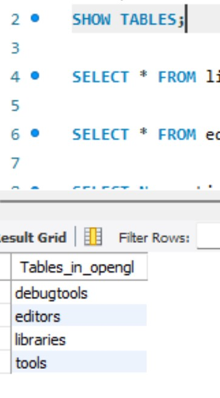
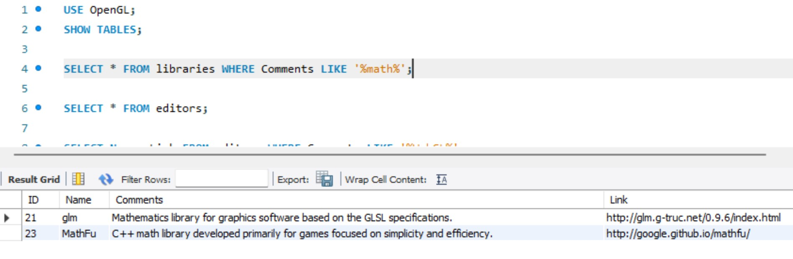

# WELCOME

Hello! My name is Kasey Myers. I am a current student at Southern New Hampshire University pursuing my *Bachelor of Science* in Computer Science with a focus in Software Engineering. The purpose of this ePortfolio is to serve as a visual tool to demonstrate the knowledge, skills, and abilities that I have acquired in my program while showcasing the value that I will bring to potential employers. The skills showcased within this portfolio are the starting point for future growth and potential in key areas surrounding Software Engineering and Development.

The artifacts that are presented in this ePortfolio demonstrate my skills in the core competencies of the Computer Science program: Software Design and Engineering, Algorithms and Data Structures, and Databases.

---

## Professional Self-Assessment

I joined the Computer Science Program at SNHU in June of 2020 after making the decision to complete my unfinished bachelor’s degree from 2012. Program completion has taken me approximately two and a half years of full-time study. I made the decision to complete my degree program after being inspired by my husband who works in the field as well and by finding that I enjoyed programming after completing several courses through Code Academy online.

While in the Computer Science Program, I have acquired and improved upon a countless number of skills, abilities, and knowledge. My attention to detail and security mindset are crucial skills to possess as a software developer and engineer. Helping to improve these skills and abilities, I tend to develop my code in blocks and test often as a part of my workflow. Testing is crucial to ensuring a program is free of flaws and vulnerabilities and functions as desired. Throughout my coursework, I have learned that adopting a security mindset as well as a testing mindset are well-required skills that allow for continuous improvement.

Attention to detail correlates to code reviews, security standards, and best practices. Thinking with security in mind early and often as opposed to nearing project completion is an avenue to a zero-trust ethic and approach that I value and improves my coding skills. By combining code reviews with my security mindset, I am able to analyze my or my peer’s code to look for mistakes and vulnerabilities that I or they may have missed during code development. Applying best practices and common coding standards allows me to produce well formatted, understood, and maintainable systems and code. In the same turn, asking for peer code review and help is a reliable and encouraged way to improve upon my skills and abilities in attention to detail and team communication. A fresh set of eyes encourages collaboration as well as code functionality.

A staple in my coursework has been learning and applying the Software Development Lifecycle and management strategies while working on a large-scale project as an individual or as part of a team. Many logistics are required for planning a large-scale project that requires coordinating with peers and fellow team members. Understanding your clients’ needs as part of the SDLC can help to translate those needs into pseudocode and algorithms that eventually result in a program. That knowledge brings gratefulness and satisfaction when put to practice. During my years of program study, the above soft skills as well as creativity, communication, and time management, have been increased and improved immensely.

**Hard Skills**
- Computer and Technology Skills	
- Data Analysis
- Data Visualization	
- Programming
- Software Development
- Technical Writing
- Security Mindset
- Mobile Development	

**Soft Skills**
- Organizational Skills
- Attention To Detail
- Critical Thinking
- Problem Solving
- Collaboration
- JAVA
- Python
- C++

Throughout the program, I have increased my capacity to learn new skills over a short span of time, bring solutions to problems with intellectual humility, and lend a leadership attitude to excel in a computer science program based on hard skills and abilities. These skills and abilities include, but are not limited to computer and technology skills, data analysis, software development, and technical writing which is demonstrated and exemplified in the artifacts accompanying this ePortfolio. This wealth of skills, abilities, and knowledge make me an excellent software engineer prospect that is focused on developing algorithms that computers understand, but perhaps more importantly, humans can understand.

---

## Code Review

---

## Software Design and Engineering

*Artifact Link:* [GL Scene Enhanced](https://github.com/kmyers0819/kmyers0819.github.io/blob/fe3fd29ea0f3904a1d718a2eabcd5ca0af01f21f/OpenGLSample.sln)

The artifact that I chose to display my competency in Software Design and Engineering is a project from my CS-330 Computer Graphics and Visualizations course completed in December of 2022. This project consisted of taking a 2d sketch, image, or photograph and recreating it in a 3D scene using OpenGL libraries and the C++ programming language in Visual Studio.

This project was one of my favorite to work on. It really encouraged a structured waterfall-like approach to developing the project. By this, I mean it was a step by step process that started with creating simple shapes such as triangles and then connecting those shapes to create primitive 3D objects. From there, we learned how to add textures, camera and camera movement, and lighting. In the end, we would end up with a 3D "world" that we could navigate using the WASD camera movements.

Primitive shape:

Primitive object:

Texture:

Light Source:

Original project render:

![original](images/original render.jpg

To enhance this project, I decided to flesh out the scene. As you can see in the original project, I had a desktop only with a globe, book, pencil cup, and a single overhead light source. The project was impressive for a first attempt but fell a bit flat. In my enhanced project, I have completed the desk, added new camera movement to include panning the camera up and down, add object movement with globe rotation, and added a second light source and new object in the form of a desk lamp.

These enhancements required updates to the source.cpp, camera.h, and shader files. The camera.h enhancements and screenshots can be found further down in the algorithms and data structures section. A final enhancement that I made was to improve portability. I have included all required libraries/packages, and files within the solution as opposed to on my local machine. So, as long as the client has the .sln file, they will have everything they need to run the program without having to download any libraries and change any pointers in the includes and libraries settings for the project.

Enhance project render:

---

## Algorithms and Data Structures

*Artifact Link:* [GL Scene Enhanced](https://github.com/kmyers0819/kmyers0819.github.io/blob/fe3fd29ea0f3904a1d718a2eabcd5ca0af01f21f/OpenGLSample.sln)

The artifact that I chose to display my competency in Data Structures and Algorithms is the same project from my CS-330 Computer Graphics and Visualizations course completed in December of 2022. This project consisted of taking a 2d sketch, image, or photograph and recreating it in a 3D scene using OpenGL libraries and the C++ programming language in Visual Studio.

I chose this artifact specifically for its algorithms used to create objects, guide camera movements, and place objects. I’ve always viewed algorithms simply as instructions. For example, how do I bake a cake? What steps are involved? Those steps, or instructions, are an algorithm. For this specific artifact, algorithms are used in abundance to create objects out of primitive forms such as squares, triangles, or cubes. Algorithms are also used to guide the camera movement and transform, or move, objects within the scene.

In my enhancement of this artifact, I have added additional camera movement options to accompany the existing WASD operations where W is zoom in, S is zoom out, A is move left, and D is move right. I have now included Q and E, where Q moves the camera up while E moves the camera down. This involved updating both the source.cpp file as well as the camera.h file to provide instructions on how the camera should operate.

Source.cpp file:

camera.h file:

In addition, I have included the steps required to incorporate new objects within the artifact such as table legs and a desk lamp. To create these new objects, I had to utilize data structures such as fixed sets to hold point values as well as an algorithm within individual methods used to create objects. This algorithm includes creating the mesh, adding the point values, transforming the object, and adding texture.

Original project:

Enhanced project:

## Databases

*Artifact Links:*

[OpenGL Accompanying Database Script](https://github.com/kmyers0819/kmyers0819.github.io/blob/c737a914be87ed4101c4d6ad1ddca37ada7f08a1/OpenGL.sql)

[Simple Query Example OpenGL DB](https://github.com/kmyers0819/kmyers0819.github.io/blob/c737a914be87ed4101c4d6ad1ddca37ada7f08a1/OpenGL%20Simple%20Query%20Example.sql)

When it came to enhancing my skills with databases, prior to the degree program, I had none. For this artifact, I chose to build a database from scratch in MySQL Workbench to accompany the artifact that I chose for the above two categories. For example, if I were to sell my program to an individual or company who wanted to build upon it, I felt it necessary to provide an accompanying database of libraries, debugging tools, and editors to make such endeavors simpler on the buyer.

Databases are an area that I could improve upon in the future. It is an area that I only had a handful of courses in and therefore, do not feel as confident with. However, I built this database from scratch using the MySQL Workbench and language. The database consists of four tables:

1. Tools: the main table that has all of the information listed in it
2. Libraries: a table created from the main table that lists only the libraries
3. Editors: a table created from the main table that lists only the editors
4. Debugging tools: a table created from the main table that lists only the debugging tools

I also wrote a simple query script to demonstrate my knowledge of querying the database. It showcases examples of showing the created tables, querying the table to display all information within it, querying the table while searching for rows that contain certain words, and querying the table to search for certain words but only display specific columns. This would allow the purchaser of the program to use my script as a template to search the database for specific information that they are looking for. For example, do they need a library for math? I have a query template for that.

As mentioned above, this is an area that I could grow in and could benefit from shadowing or interning with a database administrator to improve and hone my skills. However, with a Software Engineering focus, databases are not at the forefront of my skill set. In the future, I plan to expand my skills and abilities with SQL based databases, MongoDB, and other databse engines to better prepare myself for future positions that I may hold.

---

  

---
